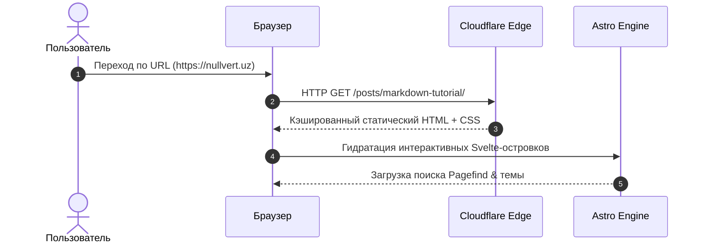
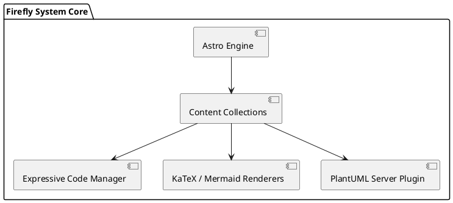

Пример оформления записей в блоге. Здесь собраны основные элементы форматирования текста, кода, формул и диаграмм.

<!-- more -->

---

## 1. Заголовки и форматирование текста

# Заголовок H1
## Заголовок H2
### Заголовок H3
#### Заголовок H4

### Стили текста, сноски и акценты
- **Полужирное начертание** (`**bold**`)
- *Курсивное выделение* (`*italic*`)
- ***Полужирный курсив*** (`***bold italic***`)
- ~~Зачеркнутый текст~~ (`~~strikethrough~~`)
- `Встроенный код` (`inline code`)
- Выделенный маркер: <mark>ключевая мысль поста</mark>
- Сноски в тексте: фреймворк Astro[^1] и тема Firefly[^2].
- Индексы и химические формулы: H<sub>2</sub>O, 2<sup>10</sup> = 1024

[^1]: Astro — современный генератор статических сайтов с архитектурой «островков» (Islands Architecture).
[^2]: Firefly — адаптивная тема для Astro с поддержкой MDX, Svelte и оптимизацией ресурсов.

---

## 2. Списки и задачи

### Стек технологий
- **Backend & Systems**
  - Rust & Tokio
  - Go & Goroutines
  - C++23 / eBPF
- **Frontend & Modern Web**
  - Astro 5, Svelte 5, TypeScript
  - Tailwind CSS v4

### Чек-лист разработки
- [x] Инициализировать Astro 5 с темой Firefly
- [x] Настроить подсветку синтаксиса Expressive Code
- [x] Добавить поддержку KaTeX, Mermaid и PlantUML
- [ ] Опубликовать первую статью в техноблоге

---

## 3. Уведомления и Callouts (Admonitions)

> [!NOTE]
> **Информация:** Блог автоматически оптимизирует все изображения и генерирует поисковый индекс Pagefind.

> [!TIP]
> **Совет:** Для быстрой навигации по коду используйте кнопки копирования и сворачиваемые блоки.

> [!IMPORTANT]
> **Важно:** Все файлы заметок поддерживают Obsidian-совместимый синтаксис вики-ссылок.

> [!WARNING]
> **Предупреждение:** Проверяйте актуальность версий пакетов в `package.json` перед сборкой.

> [!CAUTION]
> **Внимание:** Никогда не храните приватные API-ключи и токены доступа в публичном репозитории!

---

## 4. Демонстрация кодовой базы (Expressive Code)

### TypeScript: Асинхронный клиент с повторными попытками

```ts title="src/utils/fetchWithRetry.ts" {4-6} ins={14-16} del={11}
interface FetchOptions {
	retries?: number;
	backoffMs?: number;
}

export async function fetchWithRetry<T>(
	url: string,
	options: FetchOptions = {},
): Promise<T> {
	const { retries = 3, backoffMs = 500 } = options;
	// устаревший запрос: const res = await fetch(url);
	for (let attempt = 1; attempt <= retries; attempt++) {
		try {
			const response = await fetch(url);
			if (!response.ok) throw new Error(`HTTP error! status: ${response.status}`);
			return (await response.json()) as T;
		} catch (err) {
			if (attempt === retries) throw err;
			await new Promise((r) => setTimeout(r, backoffMs * attempt));
		}
	}
	throw new Error("Unexpected end of retries loop");
}
```

### Python: Обучение нейросети на PyTorch

```python title="train_model.py"
import torch
import torch.nn as nn
import torch.optim as optim

class ConvNet(nn.Module):
    def __init__(self):
        super(ConvNet, self).__init__()
        self.features = nn.Sequential(
            nn.Conv2d(3, 32, kernel_size=3, padding=1),
            nn.ReLU(),
            nn.MaxPool2d(2, 2)
        )
        self.fc = nn.Linear(32 * 16 * 16, 10)

    def forward(self, x):
        x = self.features(x)
        x = x.view(x.size(0), -1)
        return self.fc(x)

# [!code collapse:start]
# Вспомогательный цикл обучения
device = torch.device("cuda" if torch.cuda.is_available() else "cpu")
model = ConvNet().to(device)
criterion = nn.CrossEntropyLoss()
optimizer = optim.AdamW(model.parameters(), lr=1e-3)
print(f"Model initialized on device: {device}")
# [!code collapse:end]
```

### Multilanguage Code Tabs (Code Groups)

:::code-group
```go [Go Concurrent Worker]
package main

import (
	"fmt"
	"sync"
)

func worker(id int, jobs <-chan int, results chan<- int, wg *sync.WaitGroup) {
	defer wg.Done()
	for j := range jobs {
		results <- j * 2
	}
}
```
```rust [Rust Async Echo Server]
use tokio::net::TcpListener;
use tokio::io::{AsyncReadExt, AsyncWriteExt};

#[tokio::main]
async fn main() -> Result<(), Box<dyn std::error::Error>> {
    let listener = TcpListener::bind("127.0.0.1:8080").await?;
    loop {
        let (mut socket, _) = listener.accept().await?;
        tokio::spawn(async move {
            let mut buf = [0; 1024];
            while let Ok(n) = socket.read(&mut buf).await {
                if n == 0 { return; }
                let _ = socket.write_all(&buf[..n]).await;
            }
        });
    }
}
```
```cpp [C++23 Concepts & Ranges]
#include <iostream>
#include <vector>
#include <ranges>

int main() {
    std::vector<int> nums = {1, 2, 3, 4, 5, 6, 7, 8, 9, 10};
    auto even_squares = nums 
        | std::views::filter([](int n) { return n % 2 == 0; })
        | std::views::transform([](int n) { return n * n; });

    for (int v : even_squares) {
        std::cout << v << ' ';
    }
}
```
:::

---

## 5. Формулы и математика (KaTeX)

Уравнение Шрёдингера:
$$i\hbar \frac{\partial}{\partial t}\Psi(\mathbf{r},t) = \left [ -\frac{\hbar^2}{2m}\nabla^2 + V(\mathbf{r},t) \right ] \Psi(\mathbf{r},t)$$

Формула Байеса:
$$P(A|B) = \frac{P(B|A) \cdot P(A)}{P(B)}$$

Реакция термоядерного синтеза:
$$\ce{^2_1H + ^3_1H -> ^4_2He + ^1_0n + 17.6 MeV}$$

---

## 6. Визуализация и диаграммы

### Mermaid (Sequence Diagram)



### PlantUML (Архитектура компонентов)



---

## 7. Интеграция с GitHub API

Интерактивный карточный виджет для внешнего открытого репозитория **Astro**:

::github{repo="withastro/astro"}

И репозитория популярного фреймворка **Svelte**:

::github{repo="sveltejs/svelte"}

---

## 8. Изображения из открытых источников

### Одиночное изображение с автоподписью (Figure)

")

### Галерея изображений (`[grid]`)

[grid]


[/grid]

---

## 9. Дополнительные инлайновые HTML-элементы и защита E-mail

### Выпадающий список (Details & Summary)

<details>
<summary><b>Нажмите, чтобы развернуть скрытые подробности</b></summary>
<br />
Здесь содержится дополнительный текст или отладочные сведения, скрытые по умолчанию для экономии места на странице.
</details>

### Защита E-mail адресов (Base64 protection)
Контакты автора: <a href="mailto:mail@example.com">mail@example.com</a> *(автоматически кодируется плагином `rehype-email-protection`)*.

### Вики-ссылки (Obsidian style)
Поддержка связи заметок: [[markdown-tutorial|Эталонный пост верстки]].

---

## 10. Таблица характеристик

| Категория | Технология / Сервис | Описание | Лицензия |
| :--- | :--- | :--- | :---: |
| **Ядро** | Astro 5 | Быстрый статичный генератор | MIT |
| **Изображения** | Unsplash / Picsum | Открытые фото высокого качества | Unsplash Open License |
| **Карточки** | GitHub REST API | Автоматическое получение метрик репозитория | Public API |
| **Диаграммы** | Mermaid & PlantUML | Отрисовка графиков из текстового кода | MIT |

*Шпаргалка по элементам верстки блога.*